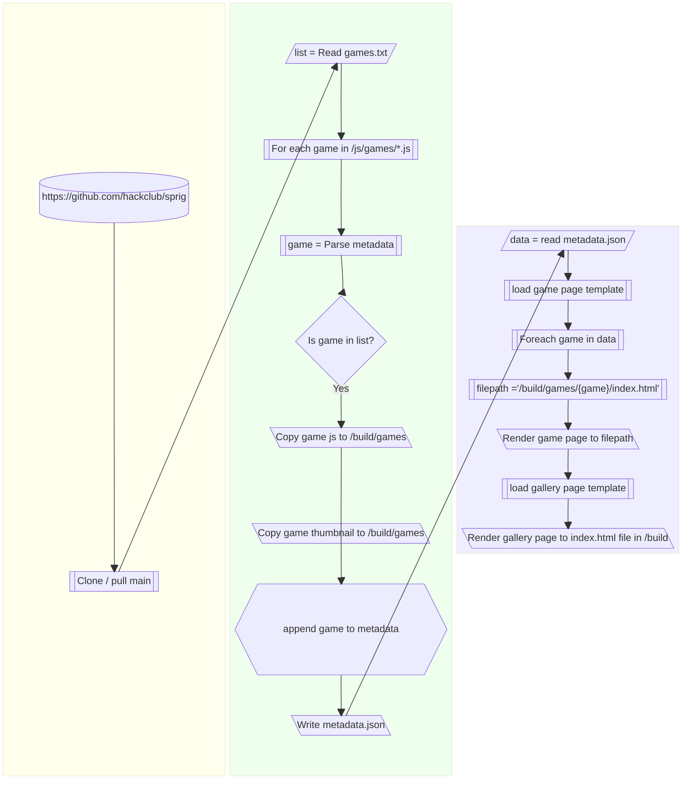

# Sprig Arcade

Visit https://utcsheffield.github.io/sprig-arcade/ for UTC Sheffield Olympic Legacy Park's Sprig Games 

If you think we should add your game add a "New Author" or "New Unapproved Sprig Game" issue.

## Instructions
* Fill out AUTHORS.txt with one author on each line
* Fill out GAMES.txt with one game title on each line
* Fill out GAMES.txt with one game url on each line (either github file preview link or raw link from anywhere)
* Run build.py
* Output in build folder

## General Idea

